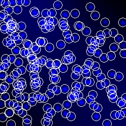
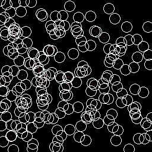
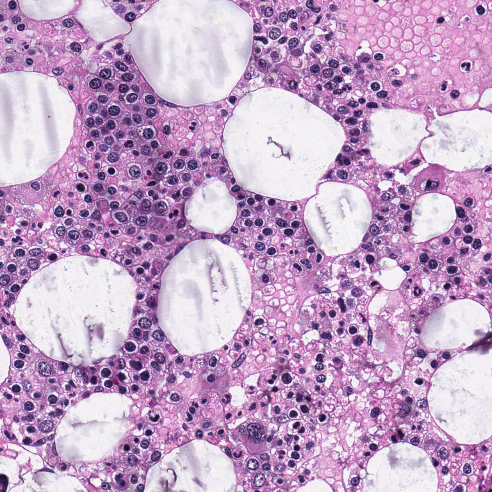

### Deep Learning on Cell Data Set

This project is fork from the original "NOAA Fisheries Steller Sea Lion Population Count" Kaggle Challenge [Sea Lion Counter](https://github.com/rdinse/sea-lion-counter). We modified the original version which can now be used on Cell Datasets([VGG](www.robots.ox.ac.uk/%7Evgg/research/counting/cells.zip) and BM_dataset_MICCAI2015). The model is based on an Inception-v4 network (pre-trained on ImageNet; Szegedy et al., 2016) and Count-ception (Cohen et al., 2017).

    

    

    

    

    

#### Tools

Python 3, Numpy, Tensorflow, OpenCV, Pandas, ...

#### Results

... in progress

____

#### More Information

* visit the fork on github of sea-lion-counter: [Cell-counter](https://github.com/nilutz/sea-lion-counter)
* or the original [Sea Lion Counter](https://github.com/rdinse/sea-lion-counter)