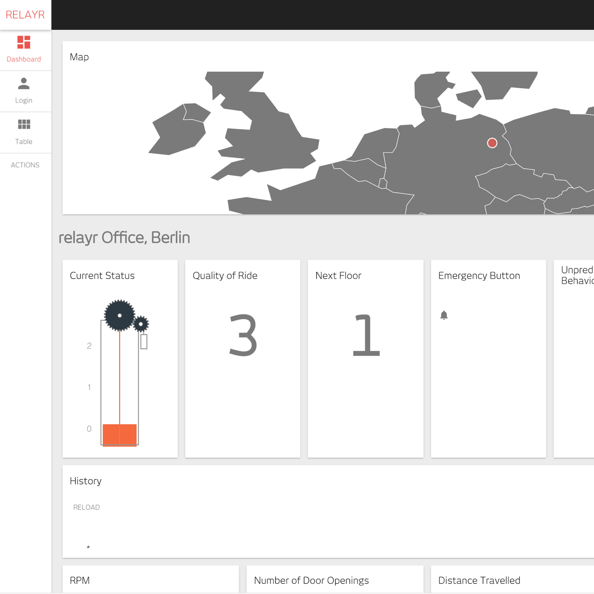
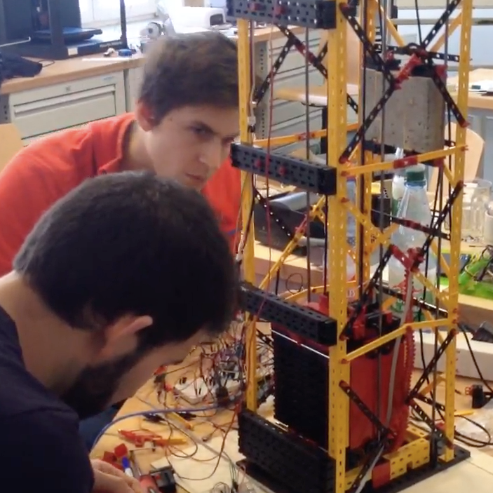
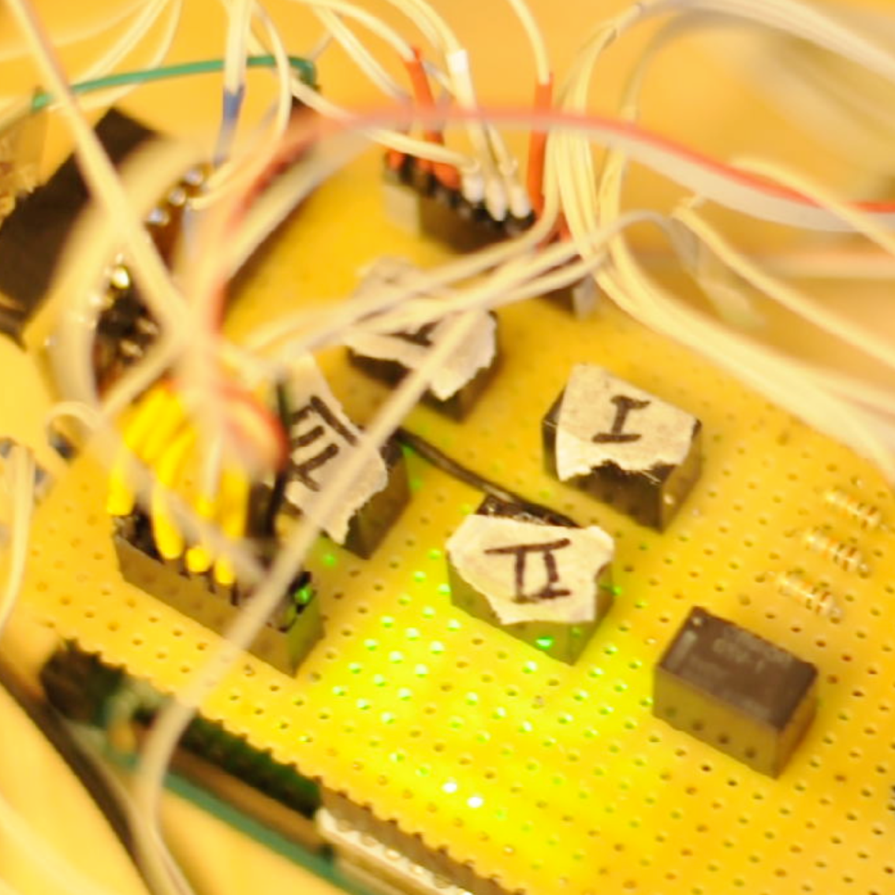

### Measuring Up and Downs

In a team I created an IoT-enabled elevator prototype demo to demonstrate how one can connect elevators to the [relayr](https://relayr.io/en/) Cloud and visualise data through the cloud. The pictures show different stages and parts of the elevator. A Dashboard was created to visualize the incoming data.

  

 
  

 
  

  

  

  

  

  

  

    

Demo Video:

    

___

#### More Information