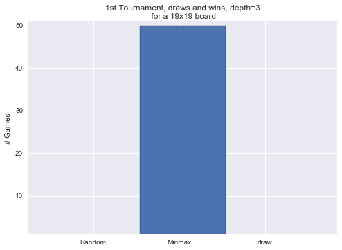
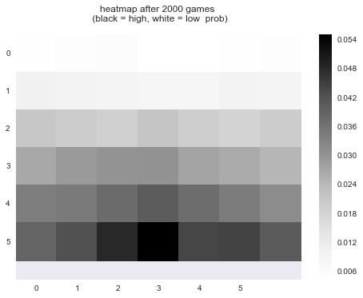

### Game AI strategies on TicTacToe and Connect Four

This projected was part of the Game AI course at Uni Bonn. Provided with the Connect Four and TicTacToe game mechanics we created an Interface and an AI based on the Minmax algorithm. Now Users can play against each other or our AI

#### Abstract

This report gives a quick overview of the presented and prepared projects of the Game AI course in SS 16. In detail a discussion of the games tic tac toe and connect four with strategies for playing against human and computer players. Furthermore we try to execute novel approaches to the Atari game breakout and quake II. In doing so techniques and strategies are presented, discussed and applied. [...] In total, three projects focusing on different game AI strategies had to be implemented and computed. Therefore one gained insight into specific problems and use cases. The first project targeted the games tic tac toe and connect four. A probabilistic and a heuristic strategy were used to implement an AI player moving against a random player. Secondly game mechanics and visualization for connect four where required. The next project build upon those tasks and focused on game trees and minmax computations for those games. Further- more a controller for the breakout game was implemented. Lastly a task was to look at path planning in its different forms. The third project concentrated on statistics for a 19 x 19 connect four board. Then a fuzzy controller naively controlling a paddle for the breakout game had to be implemented. In the last task a self organising map (SOM) and Bayesian imitation learning was used to generate trajectories.

  

  

  

#### Tools

Python 2.7, Numpy, [Kivy](https://kivy.org/#home)

___

#### More Information

* visit the github repo: [Connect Four](https://github.com/nilutz/Connectfour)
