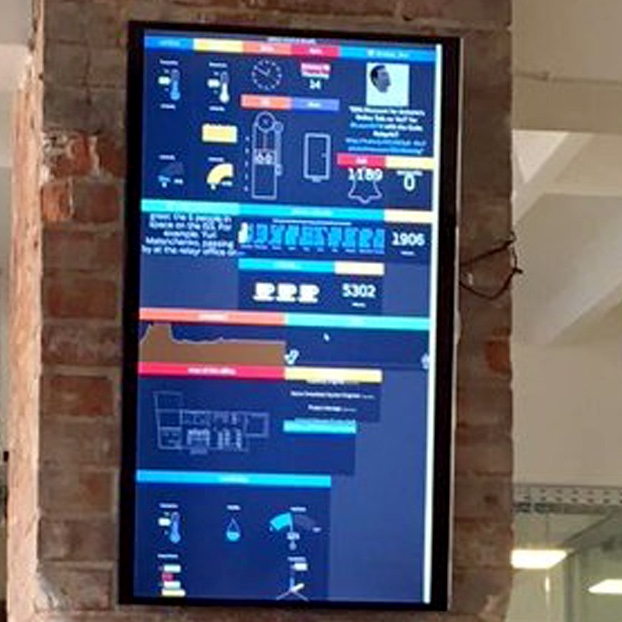

### Measuring Everything 

In my intership at [relayr](https://relayr.io/en/) I developed with a team a number of IoT prototypes, ranging from fun products to product ideas. For example we developed an Office Monitoring Systems which measured fun things such as door openings or general noise level in one spot. Furthermore we were responsible for a blog presenting new ideas. The blog is now offline but the github repository is still [available](https://github.com/relayr/blog).

  

  

  

  

  

  

  

  

  

  

  

  

___

#### More Information