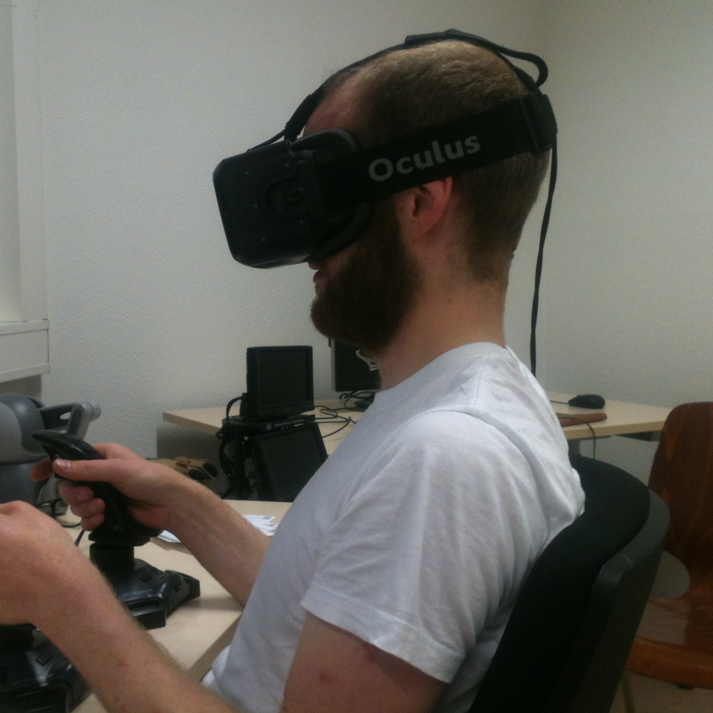
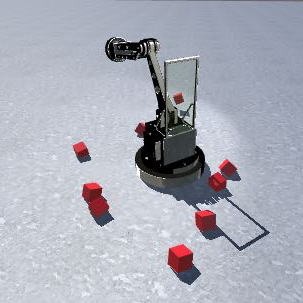
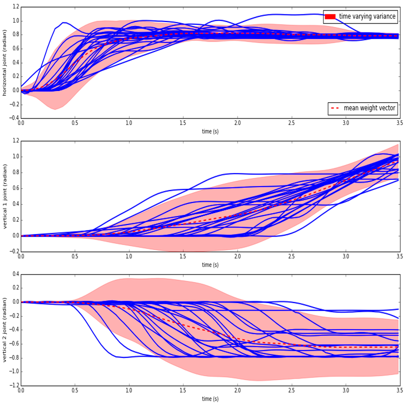
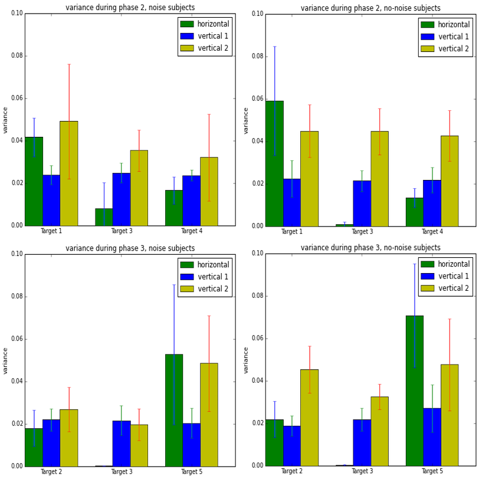

### A Bachelor Thesis utilizing Virtual Reality 

In my Bachelor thesis, during my studies of Cognitive Science, a colleague and me developed an experiment using the Oculus Rift. Simply put, we examined whether Bayesian theorem could be examined in a motor learning task in a virtual reality environment. More importantly we developed an algorithm comparing time series of different length with the help of Radial Basis functions.

  

  

  

  

  

  

#### Abstract

Learning new movements in a efficient and adaptive manner is a task humans are exceptionally good at. Even though our sensorimotor system is opposed to uncertainty due to noise corrupting our sensory input as well as our motor output are consistently precise. We are able to intuitively learn how to manipulate our limbs and ankles in order to perform a certain movement with accuracy. In our thesis we analyse how people learn to perform a reaching movement in a virtual reality set-up. The thesis comprises of conception, development and coding of the experiment in Unity 3d. We used the newly released Oculus Rift DK2 for enhancing the virtual reality set-up. Subjects are supposed to reach specific goals with a virtual robotic arm by using two joysticks. Subsequent we analyse movements in terms of multi joint manipulation and precision when learning to reach a new target by making use of previously shown targets, exploration and task relevant variability. Furthermore, we develop a trajectory model that facilitates analysis of movement patterns and variability when reaching a specific target. As we are interested in how people incorporate uncertainty, we further divide our subjects into two groups one having exact and the other probabilistic properties of translating user input into joint manipulation which enables us to investigate possible differences concerning the aforementioned aspects of movement.

#### Tools

Python, Numpy, Pandas, Oculus Rift, Unity3D

___

#### More Information