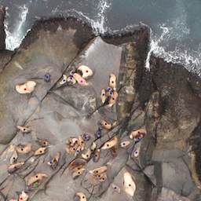
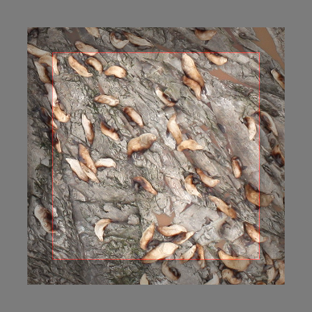
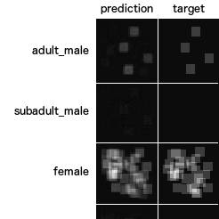

### Deep Learning on Kaggle Sea Lion Data Set

Together with a friend I participated in the [NOAA Fisheries Steller Sea Lion Population Count](https://www.kaggle.com/c/noaa-fisheries-steller-sea-lion-population-count) and was ranked 37th with our solution. The task was to count Sealion Lions from Drone imagery. We used a combination of pretrained Inception-v4, RNNs and Countception to count the sealion from the images. Currently we are exploring other Data Sets which could benefit from our approach.  

  

Sample Data:

  

Architecture:

  

  

Example Input(modified data):
    
  

Example Output:
    
  

#### Abstract

We examined the practicability of counting Stellar Sea Lions from drone imagery using neural networks. Our solution is based on a variant of density map-based counting presented by [9] called Count-ception. Our primary change to Count-ception is, rather than preserving the resolution throughout the network, to use targets that have a lower resolution than the input. This was achieved by using a pre- trained Inception-v4 network as a feature extractor and fine- tuning it on the counting task. This change significantly reduced memory and computation costs. We also experimented with using RNNs for iterative image interpretation for the counting and with providing additional context as input to the network such that it can perceive of animals that are located beyond or right at the borders of the input image patches. Our solution won the 37th place in the Kaggle challenge “NOAA Fisheries Steller Sea Lion Population Count”.

#### Tools

Python 3, Numpy, Tensorflow, OpenCV, Pandas, ...

#### Results

| Model        | Validation set RMSE           | Private Leaderboard RMSE  |
| ------------- |:-------------:| -----:|
| our model, scale 1.0      | 8.40 | 24.07 |
| our model, scale 0.5        | 9.76      |   19.46 |
| winning solution | -      |    10.86 |

___

#### More Information

* visit the github repo: [SeaLion-counter](https://github.com/rdinse/sea-lion-counter)
* winning solution: [Kaggle notebook](https://www.kaggle.com/outrunner/use-keras-to-count-sea-lions/notebook)